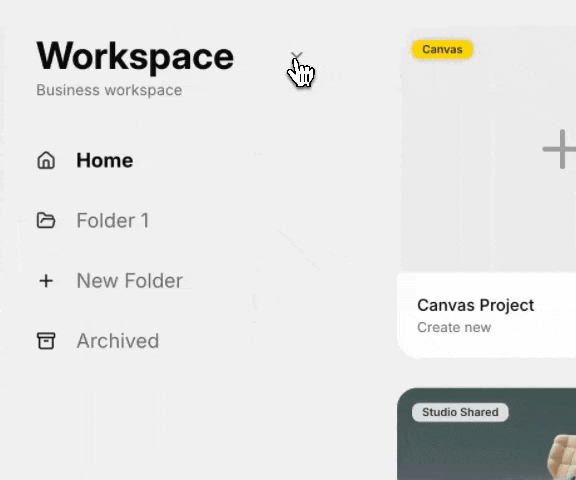

# Workspace

<figure><figcaption></figcaption></figure>

### Getting to Workspace

* Opening [canvas.vectary.com](https://canvas.vectary.com) shows a welcome screen with a **New project** card and a couple of ready-made sample Canvas projects to explore.
* From there (or from inside any Canvas project) click the **V logo** (top left) or the **Open Workspaces** button to get to Workspace.
* Picking one of the sample projects opens an editable copy of it in your Workspace.

<figure><figcaption></figcaption></figure>

### Creating a project

Two project types can be created from Workspace:

* **Canvas Project** - opens a new Canvas, an infinite board for collecting references and generating AI content with presets. 
* **Studio Project** - opens a new blank scene in Vectary Studio, the full 3D editor.

<figure><figcaption></figcaption></figure>

### Folders

The left sidebar lists folders within the workspace, used to organize Canvas and Studio projects together. Drag and drop a project onto a folder name to move it there. 

* **Home** - the default folder.
* **Archived** - stores deleted projects, which still count toward the workspace's project limit. Projects here can be **restored** or permanently **deleted**.

<figure><figcaption></figcaption></figure>

### Workspace settings

Click the gear icon (top right) to open workspace settings:

<figure><figcaption></figcaption></figure>

Three tabs are available: **Workspace**, **Limit History**, and **Billing:**




On the Workspace tab, you can do the following:

* Copy workspace ID
* Delete workspace
* Upload a workspace cover image and rename the workspace
* Invite members by email and assign their role (enter the email, pick a role, and send the invite). See the list of current members, their role, and whether they've joined.

<figure><figcaption></figcaption></figure>




Limit history tab shows a log of AI generations: what was generated, when, by whom, and how many credits it used.

<figure><figcaption></figcaption></figure>





Billing tab shows the following information:

* Current plan name
* Total project count (Canvas + Studio)
* Subscription credits and their expiry date
* Top-up credits
* Payment History - the three most recent invoices with status and amount


Invoices are sent via [**Paddle**](https://www.paddle.com/), Vectary’s payment provider. For help or assistance with your receipt or tax information, please reply to your last invoice or contact [help@paddle.com](mailto:help@paddle.com)


<figure><figcaption></figcaption></figure>




### Switching between workspaces


If you have more than one workspace (for example, you've been invited to someone else's), click the arrow next to the workspace name to see the list of workspaces.



### Profile settings

Open account settings via the profile icon (top right of Workspace):

<figure><figcaption></figcaption></figure>

Actions and information available in profile settings:

* change avatar
* see the email linked to the account
* edit name
* <kbd>**···**</kbd> menu next to the email: **Copy User ID**, **Change password**, **Log out other devices**, **Deactivate account**
* toggle **Newsletter emails** and **Comment emails**
* **Sign out**

**Tokens** 

* Enter a name and click **Create** to generate a new access token. It's shown only once - copy it right away.
* Existing tokens are listed below with their name and creation date; delete with the trash icon.

**Change email**

To change the email linked to an account, contact support via the [contact form](https://www.vectary.com/contact-us/) with:

1. Current email
2. New email
3. Access token (Tokens tab)
4. User ID (Profile tab, **···** menu → Copy User ID)

